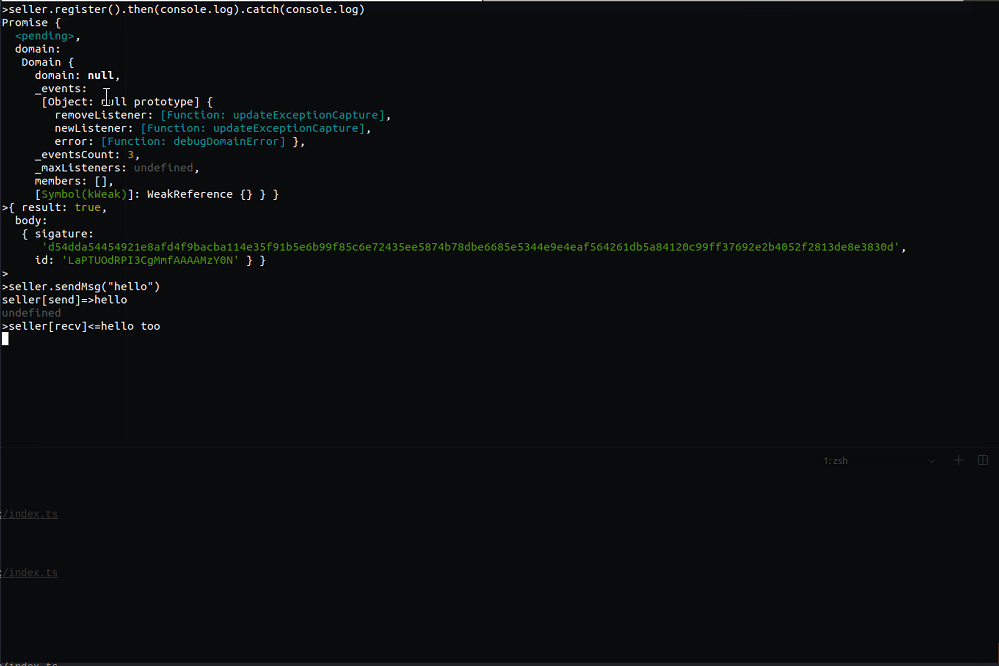
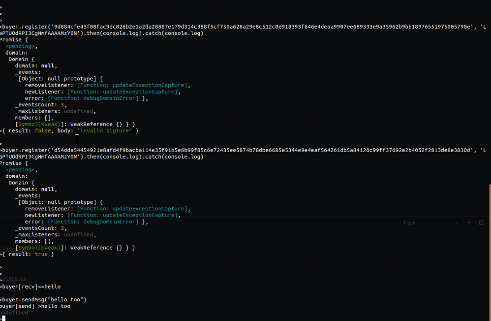

# Services
## compile
```
yarn compile
```
## example
```
# start server
ts-node src/index.ts
# start seller
ts-node example/seller.ts
# start buyer
ts-node example/buyer.ts
```
## screenshot

### seller


### buyer
